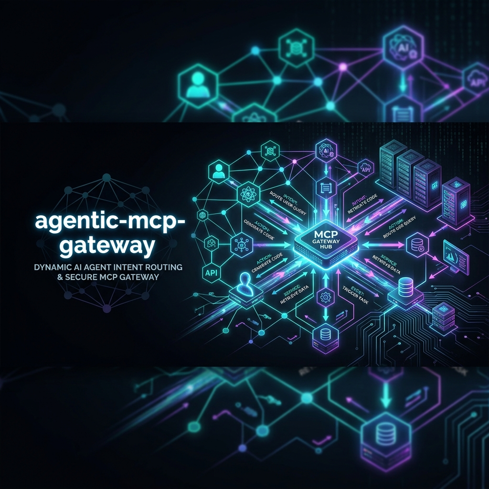
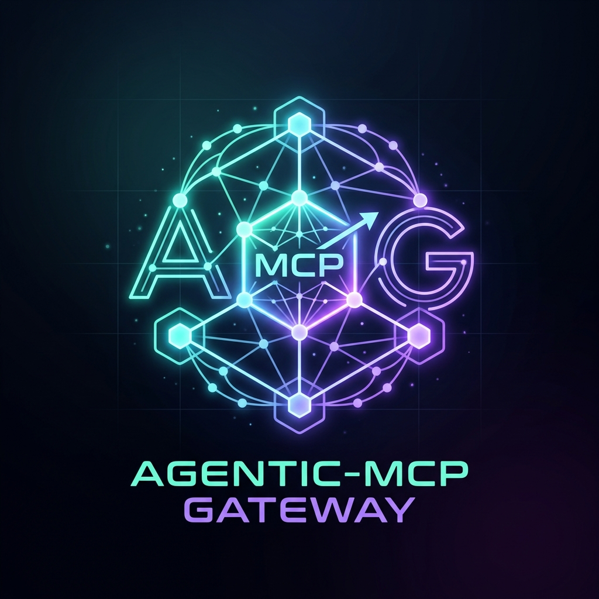
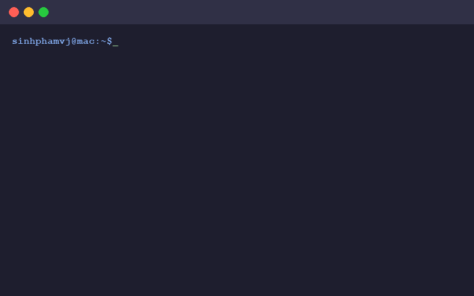
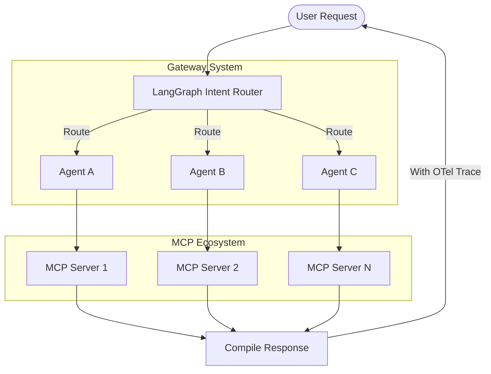

<p align="center">
  
</p>

<p align="center">
  
</p>

<h1 align="center">agentic-mcp-gateway</h1>

<p align="center">
  <strong>Connect any LLM to any MCP server through a single LangGraph-powered gateway</strong>
</p>

<p align="center">
  <a href="https://github.com/sinhphamvj/agentic-mcp-gateway/actions"></a>
  <a href="https://opensource.org/licenses/Apache-2.0"></a>
  <a href="https://github.com/sinhphamvj/agentic-mcp-gateway"></a>
</p>

---

`agentic-mcp-gateway` is an open-source Python framework for building robust, multi-server Model Context Protocol (MCP) agent workflows. Run any LLM (OpenAI, NVIDIA NIM, Anthropic, Ollama) and orchestrate tool usage across multiple independent MCP servers using an intelligent LangGraph intent classifier.

## Demo

<p align="center">
  
</p>

## Features

- **Multi-LLM**: Seamlessly switch between OpenAI, Anthropic, NVIDIA NIM, and Ollama.
- **Multi-MCP**: Connect and orchestrate multiple Model Context Protocol (MCP) servers.
- **LangGraph Integration**: Built-in intent routing and agent orchestration.
- **Skills Export**: OpenClaw-compatible skill export for agent tooling.
- **OTel Observability**: Native OpenTelemetry tracing and integration with Arize Phoenix.
- **YAML-first Configuration**: Define workflows and connections cleanly with declarative YAML.

## Architecture



## Why agentic-mcp-gateway?

Most current solutions for Model Context Protocol (MCP) are either single-client SDKs or rigid adapters. `agentic-mcp-gateway` bridges the gap between raw LLM capabilities and complex multi-server environments by using **LangGraph** to perform intelligent routing, state management, and orchestration.

### Design highlights

| Capability | How it works in `agentic-mcp-gateway` |
| :--- | :--- |
| **Multi-server orchestration** | A single gateway process connects to N MCP servers; an intent classifier routes each request to the right one (or chains them). |
| **Stateful workflows** | Built on LangGraph — every step is a node in a `StateGraph` with typed `GatewayState` flowing through it. |
| **Swappable LLM backend** | One config field switches between OpenAI, Anthropic, NVIDIA NIM, and any Ollama-compatible endpoint. |
| **Structured tool routing** | An LLM-driven intent classifier picks the target server from a schema; routing logic is a plain Python function you can override. |
| **OpenTelemetry by default** | Every request, classifier call, and tool invocation is traced. Point `OTEL_EXPORTER_OTLP_ENDPOINT` at Arize Phoenix (or any OTel collector) to inspect. |
| **OpenClaw skill export** | `amcpg skills openclaw-setup` turns your configured tools into a `SKILL.md` compatible with the OpenClaw skill format. |
| **YAML-first configuration** | Define LLM, agents, and MCP servers in `workflow.yaml`; no Python glue required for the common case. |

## Quick Start

Follow these 5 steps to get up and running:

1. **Install uv** (the recommended Python package manager):
   ```bash
   curl -LsSf https://astral.sh/uv/install.sh | sh
   ```

2. **Install the gateway** (from the repo root):
   ```bash
   uv sync
   ```

3. **Start an MCP server** (e.g., local filesystem):
   ```bash
   uv run python -m servers.filesystem.server --port 8000
   ```

4. **Start the gateway**:
   ```bash
   uv run amcpg serve --config workflow.yaml
   ```

5. **Test it**:
   ```bash
   curl -X POST http://localhost:8001/v1/chat/completions \
     -H "Content-Type: application/json" \
     -d '{"messages": [{"role": "user", "content": "List tables in the database"}]}'
   ```

## Configuration Guide

The gateway is configured via a simple YAML file (`workflow.yaml`). Here is a basic example:

```yaml
llm:
  provider: openai
  model_name: gpt-4o-mini
  api_key_env: OPENAI_API_KEY
  temperature: 0.0
  max_tokens: 4096

mcp_servers:
  - name: local-fs
    transport: http
    url: http://localhost:8000/mcp
    description: "Local filesystem MCP server"

intents:
  - name: FILE_OPERATION
    description: Read, list, or search files on the local filesystem
    mcp_server: local-fs
    system_prompt: |
      You are a filesystem assistant. Use the available tools to
      list directories, read files, and search for files.

gateway_port: 8001
enable_tracing: true
human_in_the_loop_intents: []
```

## LLM Providers

| Provider | Supported Models | Required Environment Variable |
| --- | --- | --- |
| **OpenAI** | `gpt-4o`, `gpt-4-turbo`, `gpt-3.5-turbo` | `OPENAI_API_KEY` |
| **Anthropic** | `claude-3-opus`, `claude-3-sonnet` | `ANTHROPIC_API_KEY` |
| **NVIDIA NIM** | `meta/llama3-70b-instruct`, etc. | `NVIDIA_API_KEY` |
| **Ollama** | `llama3`, `mistral`, `phi3` | `OLLAMA_BASE_URL` (default: http://localhost:11434/v1) |

## MCP Servers

| Server Type | Description | Common Use Case |
| --- | --- | --- |
| **Database** | SQL / NoSQL database integrations | Querying application data |
| **Filesystem** | Local or remote file access | Reading/writing configurations and logs |
| **REST API** | Generic HTTP integrations | Interacting with external SaaS platforms |

## Custom Server Guide

Adding a custom MCP server is straightforward. Any MCP-compliant server that implements `@server.list_tools()` and `@server.call_tool()` over an HTTP transport (e.g., using Starlette + Uvicorn) can be plugged directly into the gateway. Just add it to your `workflow.yaml`:

```yaml
mcp_servers:
  - name: my-custom-server
    url: http://custom-server:8000
```

## OpenClaw Integration

Export your configured MCP tools as OpenClaw-compatible skills with a single command. This allows external agents to natively understand and utilize your MCP ecosystem.

```bash
amcpg skills openclaw-setup --output ./skills.json
```

## Observability

We use OpenTelemetry to trace every step of your LLM interactions and tool calls. 
- Ensure `OTEL_EXPORTER_OTLP_ENDPOINT` is set in your environment.
- Start Arize Phoenix locally (default port `6006`) to view your traces: `PHOENIX_PORT=6006 python -m phoenix.server`

## Real-World Use Cases

### 1. File Analyst Agent
Inspects repository changes, audits security rules, and runs linters.
- **Server**: `mcp-server-filesystem`
- **Intent**: `FILE_ANALYSIS` (reads files, processes content, returns reports)
- **Prompt**: *"Analyze my project dependencies and suggest version updates."*

### 2. Live Database Assistant
Provides natural language querying and schema exploration.
- **Server**: `demo-db` (SQLite/PostgreSQL)
- **Intent**: `QUERY` (translates user request to SELECT queries, executes safely)
- **Prompt**: *"Find the top 5 customers who placed the most orders last month."*

### 3. DevOps Assistant
Orchestrates CLI tooling, server statuses, and deployments.
- **Server**: Local command-line tool integrations
- **Intent**: `DEPLOY` (verifies build, checks status, triggers deployment)

## Roadmap

- [x] **v0.1.0 (Current)**: LangGraph intent routing, OTel tracing, YAML config, SQLite demo.
- [ ] **v0.2.0**: Advanced multi-agent conversation states, persistent chat memory.
- [ ] **v0.3.0**: Native Web UI for visual workflow building and real-time trace inspection.
- [ ] **v0.4.0**: Authentication and access-control list (ACL) support for secure server access.

## Reference Implementations

The following end-to-end examples live in this repository and demonstrate real, runnable workflows built on the gateway:

- [`examples/devops-assistant`](./examples/devops-assistant) — Natural-language control of Docker containers and logs.
- [`examples/music-store`](./examples/music-store) — Multi-agent querying over a SQLite music catalog.
- [`examples/research-agent`](./examples/research-agent) — Research workflow orchestrated through MCP tool routing.

> **Using `agentic-mcp-gateway` in production?** Open a PR to add your project to this list.

## Sponsors

Support this project to help us build a more open and connected agent ecosystem!
- [Sponsor sinhphamvj on GitHub](https://github.com/sponsors/sinhphamvj)

## Contributing

We welcome contributions! Please see our [CONTRIBUTING.md](./CONTRIBUTING.md) for details on how to set up the development environment, run tests, and submit pull requests.

## License

This project is licensed under the Apache-2.0 License - see the [LICENSE](./LICENSE) file for details.

## Star History

[](https://star-history.com/#sinhphamvj/agentic-mcp-gateway&Date)
