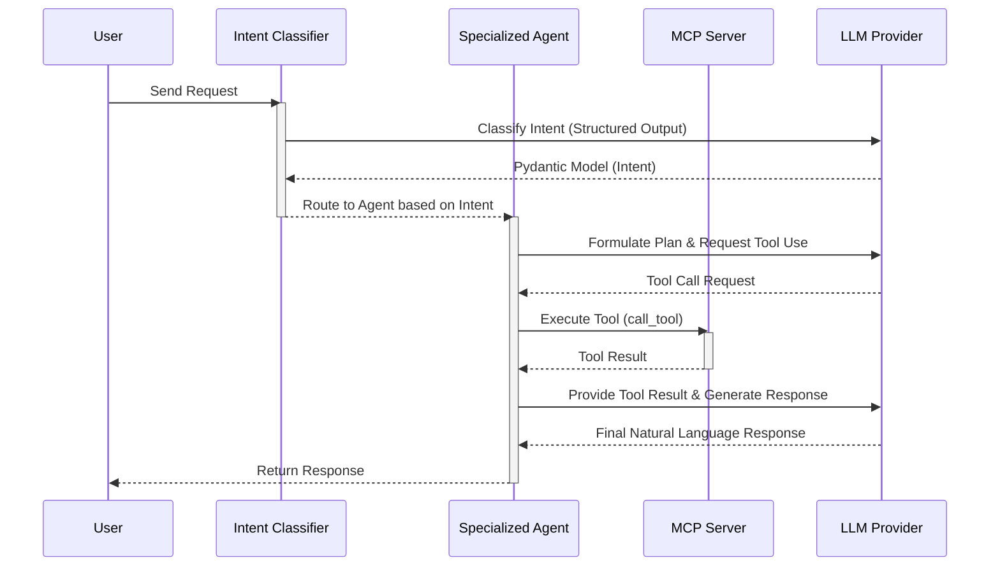

# Architecture

The Agentic MCP Gateway provides a robust, scalable framework for building multi-agent systems connected to disparate MCP (Model Context Protocol) servers. 

## Overview

At its core, the gateway leverages **LangGraph** to route user intents to specialized agents, each equipped with its own set of MCP-powered tools. The architecture is designed to be highly observable via **OpenTelemetry**, strictly typed via **Pydantic**, and dynamically configurable via YAML.

## Core Components

### 1. Orchestrator (LangGraph Node)
The central nervous system of the gateway. It maintains the overall state of the conversation (using `Annotated[list, add_messages]`), handles the execution graph, and manages human-in-the-loop interruptions for sensitive or destructive operations.

### 2. Router (Intent Classifier)
A specialized LangGraph node responsible for analyzing incoming user requests. It uses structured output (via Pydantic) to classify the user's intent and route the execution to the most appropriate downstream agent.

### 3. Agent Nodes
Specialized execution nodes. Each agent is responsible for a specific domain and interacts directly with its assigned MCP servers. If an agent cannot resolve a query, it can formulate a response or pass the context back to the orchestrator.

### 4. MCP Connection Manager
Handles the lifecycle of MCP server connections. It uses the `mcp[cli]` SDK to manage sub-processes (for local tools) or HTTP/SSE transports (for remote tools). It parses the `@server.list_tools()` definitions and makes them available as executable tools to the LLM.

### 5. LLM Clients
An abstraction layer over providers like OpenAI, Anthropic, NVIDIA NIM, and Ollama. The provider can be swapped dynamically via the `workflow.yaml` configuration without any code changes.

## Data Flow

The following sequence diagram illustrates how a user request is processed through the gateway, routed to a specialized agent, and resolved using an MCP tool.

## Extension Points

The architecture is highly extensible:
*   **Custom Agents**: Add new nodes to the LangGraph execution graph.
*   **New MCP Transports**: The Connection Manager can be extended to support custom transport layers beyond standard stdio and HTTP.
*   **Observability Exporters**: By default, traces are sent via OTLP (compatible with Arize Phoenix), but you can plug in any OpenTelemetry-compatible backend.
