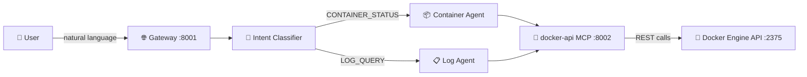

# DevOps Assistant — Container & Log Management

An **agentic-mcp-gateway** demo that turns natural-language requests into
Docker Engine API calls. Ask about running containers, resource usage, or
application logs — the gateway classifies your intent and routes it to the
right agent, which queries Docker through a REST-to-MCP bridge.

---

## Architecture



---

## Prerequisites

| Requirement | Version |
|---|---|
| Python | 3.12+ |
| uv | latest (`pip install uv`) |
| Docker Engine | with API access (TCP **or** socket) |
| OpenAI API key | set as `OPENAI_API_KEY` env var |

---

## Quick Start

### 1. Enable the Docker Engine API

The Docker daemon must be reachable over HTTP so the MCP server can call it.

**Option A — TCP (development only)**

```bash
# Add to /etc/docker/daemon.json
{ "hosts": ["unix:///var/run/docker.sock", "tcp://0.0.0.0:2375"] }
sudo systemctl restart docker
```

**Option B — socat proxy (safer)**

```bash
socat TCP-LISTEN:2375,fork UNIX-CONNECT:/var/run/docker.sock &
```

Verify access:

```bash
curl http://localhost:2375/version
```

### 2. Start the REST API MCP Server

From the repository root, launch the REST API MCP server that acts as a
bridge between MCP tool calls and arbitrary HTTP endpoints (including Docker):

```bash
uv run python -m gateway.mcp_servers.rest_api_server --port 8002
```

The server exposes a `call_api` tool at `http://localhost:8002/mcp`.

### 3. Start the Gateway

```bash
export OPENAI_API_KEY="sk-..."
uv run amcpg --config examples/devops-assistant/workflow.yaml
```

The gateway is now listening on **http://localhost:8001**.

---

## Example Queries

### Container Status (CONTAINER_STATUS intent)

| # | Query |
|---|---|
| 1 | *"Show me all running containers."* |
| 2 | *"What ports is the nginx container exposing?"* |
| 3 | *"How much memory is the postgres container using?"* |
| 4 | *"List all Docker images on this host."* |

### Log Analysis (LOG_QUERY intent)

| # | Query |
|---|---|
| 5 | *"Show me the last 50 lines of logs from the web-app container."* |
| 6 | *"Are there any errors in the api-server logs?"* |
| 7 | *"Diagnose why the worker container keeps restarting."* |

---

## Security Note

> [!WARNING]
> The Docker Engine API grants **full root-level access** to the host. Exposing
> it over TCP without TLS is acceptable only in isolated development
> environments. **Never** expose port 2375 to untrusted networks.
>
> For production use:
>
> - Enable [TLS mutual authentication](https://docs.docker.com/engine/security/protect-access/)
>   on the Docker daemon.
> - Bind the TCP listener to `127.0.0.1` only.
> - Consider a read-only API proxy such as
>   [tecnativa/docker-socket-proxy](https://github.com/Tecnativa/docker-socket-proxy)
>   to restrict which endpoints are reachable.

---

## License

Apache-2.0 — see [LICENSE](../../LICENSE) for details.
