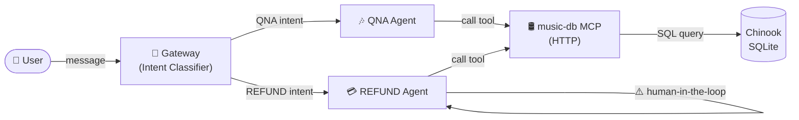

# 🎵 Music Store Demo — Chinook Database Assistant

> **agentic-mcp-gateway** example · Intent routing · Human-in-the-loop · SQLite MCP

A complete example showing how the **Agentic MCP Gateway** connects an LLM to the
[Chinook](https://github.com/lerocha/chinook-database) music store database through
an MCP tool server. The gateway classifies user messages into **QNA** (general
queries) or **REFUND** (billing disputes) intents and routes them to the
appropriate agent — with mandatory human approval for any refund operation.

---

## Architecture



---

## Prerequisites

| Requirement | Minimum Version |
|-------------|-----------------|
| Python | 3.12+ |
| [uv](https://github.com/astral-sh/uv) | latest |
| OpenAI API key | — |

Set your API key:

```bash
export OPENAI_API_KEY="sk-..."
```

---

## Quick Start

### 1 · Download the Chinook database

```bash
cd examples/music-store
bash data/download_chinook.sh
```

This fetches the official Chinook SQLite file from
[lerocha/chinook-database](https://github.com/lerocha/chinook-database) and saves
it as `data/chinook.db`.

### 2 · Start the database MCP server

```bash
# From the repository root
uv run python -m servers.database \
  --db-path examples/music-store/data/chinook.db \
  --port 8000
```

The MCP server exposes a `query_database` tool at `http://localhost:8000/mcp`.

### 3 · Start the gateway

```bash
GATEWAY_CONFIG=examples/music-store/workflow.yaml uv run amcpg
```

The gateway starts on **port 8001** (configurable in `workflow.yaml`).

---

## Example Queries

### QNA intent (general questions)

| # | Query |
|---|-------|
| 1 | *"How many tracks are in the database?"* |
| 2 | *"List all albums by Led Zeppelin."* |
| 3 | *"What are the top 5 genres by number of tracks?"* |
| 4 | *"Show me all customers from Brazil."* |
| 5 | *"Which playlist has the most tracks?"* |

### REFUND intent (requires human approval)

| # | Query |
|---|-------|
| 6 | *"I want a refund for invoice #42."* |
| 7 | *"I was double-charged — my email is luis@example.com."* |

> [!IMPORTANT]
> REFUND requests trigger a **human-in-the-loop** interrupt via LangGraph's
> `interrupt()` mechanism. The gateway will pause and wait for explicit operator
> approval before executing any refund-related database mutations.

---

## Configuration

The `workflow.yaml` file controls the entire pipeline:

| Field | Description |
|-------|-------------|
| `llm` | LLM provider, model, temperature, and token limit |
| `mcp_servers` | List of MCP tool servers (name, transport, URL) |
| `intents` | Intent definitions with routing target and system prompt |
| `gateway_port` | Port the gateway HTTP server listens on |
| `enable_tracing` | Enable OpenTelemetry tracing (`true` / `false`) |
| `human_in_the_loop_intents` | Intents that require human approval before execution |

### Swapping the LLM

Change the `llm` block to use a different provider — no code changes required:

```yaml
llm:
  provider: ollama
  model_name: llama3
  api_key_env: ""            # not needed for local Ollama
  temperature: 0.0
  max_tokens: 4096
```

---

## Project Structure

```
examples/music-store/
├── README.md            # This file
├── workflow.yaml        # Gateway + intent configuration
└── data/
    ├── download_chinook.sh   # Database download script
    └── chinook.db            # SQLite database (after download)
```

---

## License

Apache-2.0 — see [LICENSE](../../LICENSE) for details.
