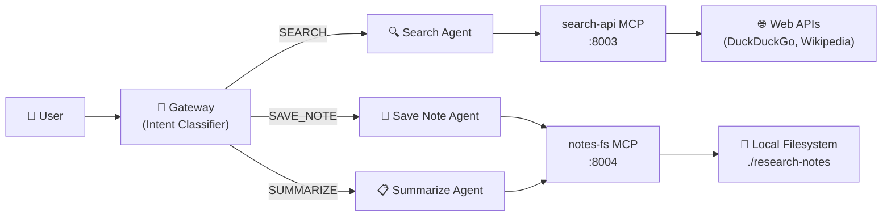

# Research Agent — Multi-Source Search & Notes

A demo agent that connects **two MCP servers** through a single gateway to
search the web, save research notes, and summarize findings — all routed
automatically by the LangGraph intent classifier.

## Architecture



| Component | Port | Role |
|-----------|------|------|
| Gateway | `8001` | Intent classification & agent orchestration |
| search-api MCP | `8003` | REST-to-MCP bridge for web search APIs |
| notes-fs MCP | `8004` | Filesystem MCP server for note storage |

## Prerequisites

| Requirement | Version |
|-------------|---------|
| Python | 3.12+ |
| uv | latest |
| OpenAI API key | set as `OPENAI_API_KEY` |

```bash
# Install the project (from repo root)
uv sync
```

## Quick Start

### 1. Start the REST API MCP server (search)

```bash
# Terminal 1 — serves search tools on port 8003
uv run python -m servers.rest_api.server \
    --port 8003
```

### 2. Start the Filesystem MCP server (notes)

```bash
# Terminal 2 — serves filesystem tools on port 8004
mkdir -p research-notes

uv run python -m servers.filesystem.server \
    --port 8004 \
    --allowed-root ./research-notes
```

> [!IMPORTANT]
> The `ALLOWED_ROOT` restricts file operations to the `./research-notes`
> directory. The server will reject any path outside this root.

### 3. Start the gateway

```bash
# Terminal 3 — starts the gateway with the research-agent workflow
export OPENAI_API_KEY="sk-..."

uv run amcpg serve \
    --config examples/research-agent/workflow.yaml
```

The gateway is now listening on **http://localhost:8001**.

## Example Queries

### 🔍 SEARCH intent

```text
Search for recent advances in quantum error correction
```

```text
What is retrieval-augmented generation and how does it work?
```

```text
Find information about the 2024 Nobel Prize in Physics
```

### 💾 SAVE_NOTE intent

```text
Save a note about transformer architecture: self-attention computes
weighted sums of value vectors using query-key dot products.
```

```text
Save my research findings on CRISPR delivery methods to a note
called gene-editing-delivery.md
```

### 📋 SUMMARIZE intent

```text
Summarize all my saved research notes
```

```text
Give me a summary of the notes on quantum computing
```

## Multi-Server Architecture

This example demonstrates a core capability of the gateway:
**routing a single user request to the right MCP server** without the user
needing to know which server handles which tool.

```
User: "Search for LLM benchmarks and save a summary"
  │
  ├─ Intent Classifier → SEARCH
  │    └─ search-api MCP → DuckDuckGo API → results
  │
  └─ (follow-up) Intent Classifier → SAVE_NOTE
       └─ notes-fs MCP → ./research-notes/llm-benchmarks.md
```

Each MCP server is **independent and stateless**. The gateway:

1. **Classifies** the user's intent using structured LLM output
   (`SEARCH`, `SAVE_NOTE`, or `SUMMARIZE`).
2. **Routes** the request to the matching agent, which is bound to
   a specific MCP server.
3. **Executes** the tool call through the MCP protocol over HTTP.
4. **Traces** every step with OpenTelemetry spans for full observability.

### Adding more servers

To extend this workflow — for example, adding an arXiv search server — add
a new entry to `mcp_servers` and a corresponding intent in `workflow.yaml`:

```yaml
mcp_servers:
  # ... existing servers ...
  - name: arxiv-search
    transport: http
    url: http://localhost:8005/mcp
    description: "MCP server for searching arXiv papers"

intents:
  # ... existing intents ...
  - name: SEARCH_PAPERS
    description: "Search for academic papers on arXiv"
    mcp_server: arxiv-search
    system_prompt: |
      You are an academic paper search assistant.
      Use the search tool to find papers on arXiv.
      Return titles, authors, abstracts, and links.
```

No gateway code changes required — just update the YAML and restart.

## License

Apache-2.0 — see [LICENSE](../../LICENSE) for details.
